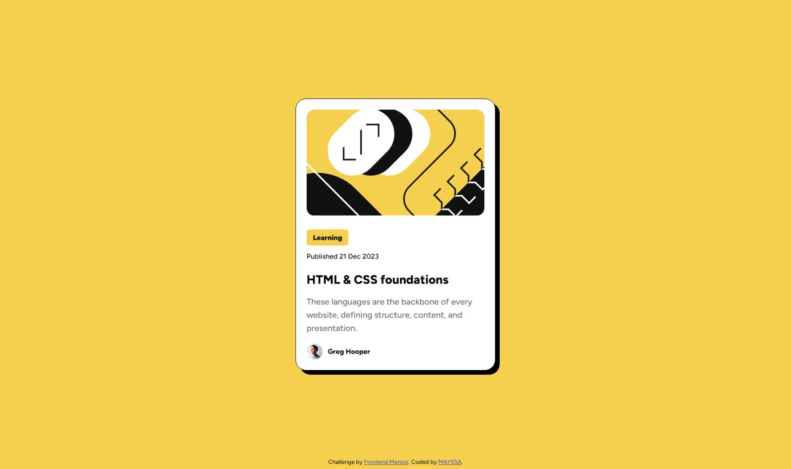

# Frontend Mentor - Blog preview card solution

This is a solution to the [Blog preview card challenge on Frontend Mentor](https://www.frontendmentor.io/challenges/blog-preview-card-ckPaj01IcS). Frontend Mentor challenges help you improve your coding skills by building realistic projects. 

## Table of contents

- [Overview](#overview)
  - [The challenge](#the-challenge)
  - [Screenshot](#screenshot)
  - [Links](#links)
- [My process](#my-process)
  - [Built with](#built-with)
  - [What I learned](#what-i-learned)
- [Author](#author)

**Note: Delete this note and update the table of contents based on what sections you keep.**

## Overview

### The challenge

Users should be able to:

- See hover and focus states for all interactive elements on the page

### Screenshot




### Links

- Solution URL: https://www.frontendmentor.io/solutions/responsive-blog-card-with-resizable-fonts-k4qi2btZy5
- Live Site URL: https://may55a.github.io/blog-preview-card/

## My process

### Built with

- Semantic HTML5 markup
- CSS custom properties
- Flexbox


### What I learned

While working through this project. One of the issues that I encountered was how to fit the body to full page in the simplest and easiest way and after some research and trial, this is what I ended up with :


```css
html {
  height: 100%;
}

body {
  height: 100%;
  margin: 0;
}
```
I also learned how to use the CSS clamp() function that allows you to set a font size that adapts to the screen size while defining minimum and maximum values. This is an example used in body :

```css

body {
  font-size: clamp(14px, 2vw, 16px);
}
```
I also used it for the illustration image along with the object fit property that allows you to specify how the  image should be resized to fit its container:

```css

#illustration {
  width: clamp(280px, 33vw, 335px);
  height: 200px;
  object-fit: cover;
}
```

## Author

- Frontend Mentor - [@MAY55A](https://www.frontendmentor.io/profile/MAY55A)
- LinkedIn - [@Mayssa Ghanmi](https://www.linkedin.com/in/mayssa-ghanmi-a85369276)
